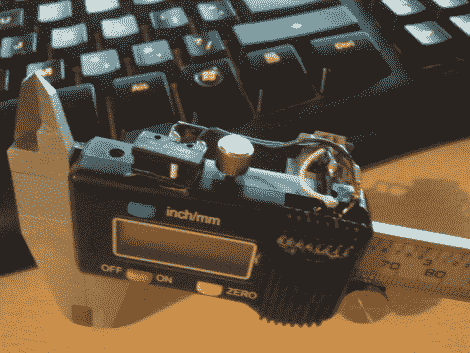

# 数字卡尺上的保持、快速和最大功能

> 原文：<https://hackaday.com/2011/01/12/hold-fast-and-max-features-on-a-digital-caliper/>

在给他的数字卡钳添加 RJ-11 连接器时，[BadWolf]滑了一下，短路了一个引脚，[意外地发现了新功能](http://www.facebook.com/album.php?aid=50058&id=164067670272981)。他打算[增加一个电子读取测量数据的端口](http://hackaday.com/2010/12/15/reading-a-digital-caliper-with-a-microcontroller/)，但是在出现失误后，LCD 屏幕上出现了一个“H ”,测量结果被冻结在同一个数字上。起初看起来他可能已经关闭了设备，但这实际上是一个保持功能。再玩一会儿，他发现按键的组合也可以实现快速功能，加快显示器改变读数的速度。甚至有一个最大值功能，只有当读数高于任何先前显示的测量值时，才更新显示。这些都是很好的功能，他通过在两个输出引脚之间连接一个瞬时按钮开关来使用，细节我们在休息后从带注释的视频中收集。他没有说哪些引脚为他工作，但我们打赌其中一个是端口上的接地引脚，另一个是两个数据引脚中的一个。用你自己的卡尺做一些调查，让我们知道你在评论中发现了什么。

 <https://www.youtube.com/embed/-C9CS72SFM0?version=3&rel=1&showsearch=0&showinfo=1&iv_load_policy=1&fs=1&hl=en-US&autohide=2&wmode=transparent>

 </body> </html>