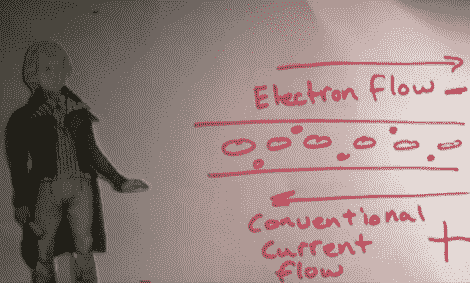

# 让纸娃娃教你科学

> 原文：<https://hackaday.com/2011/01/13/let-paper-dolls-teach-you-science/>

还记得高中学习化学和物理有多有趣吗？我们猜测你的记忆取决于教这门课的人。为什么不从我们最喜欢的老师之一[Jeri Ellsworth]那里学一学电子学的基础知识呢？

你知道，那个[做化学实验](http://hackaday.com/2010/10/19/more-el-chemistry-luminescent-ink/)和[自己做半导体](http://hackaday.com/2010/11/05/making-point-contact-transistors/)的人？这篇文章的第一个链接会把你带到她的视频播放列表。到目前为止，她张贴了 A 是安培和 B 是电池，这两个你会发现休息后嵌入。她结合了严肃的技术解释和严肃的纸娃娃历史重演，无论你是否保留了任何信息，这都是一种有趣的观看。

[https://www.youtube.com/embed/DSj1SH5Zpqg?version=3&rel=1&showsearch=0&showinfo=1&iv_load_policy=1&fs=1&hl=en-US&autohide=2&wmode=transparent](https://www.youtube.com/embed/DSj1SH5Zpqg?version=3&rel=1&showsearch=0&showinfo=1&iv_load_policy=1&fs=1&hl=en-US&autohide=2&wmode=transparent)

[https://www.youtube.com/embed/XOxMUZUJUS4?version=3&rel=1&showsearch=0&showinfo=1&iv_load_policy=1&fs=1&hl=en-US&autohide=2&wmode=transparent](https://www.youtube.com/embed/XOxMUZUJUS4?version=3&rel=1&showsearch=0&showinfo=1&iv_load_policy=1&fs=1&hl=en-US&autohide=2&wmode=transparent)

[感谢 PT]