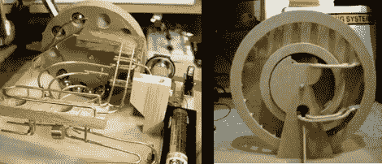

# 动力项目 Duo 的喜悦和娱乐

> 原文：<https://hackaday.com/2011/01/13/kinetic-project-duo-to-delight-and-amuse/>

我们将让你决定这两个项目中哪一个是令人愉快的，哪一个是有趣的。

左边的项目是桌面动态雕塑。我们喜欢它是因为它的大小和简单。一节 AA 电池驱动为金属球提供升力的齿轮头马达。有几条不同的路线可以让它们返回升降轮，每条路线都由金属球的机械组合决定。这是一个多月的建设比一些[其他动能装置](http://hackaday.com/2010/12/20/kinetic-sculpture-takes-a-page-from-modern-life/)我们已经看到可能需要一生。

右边的产品是[永动机](http://www.youtube.com/watch?v=40H47Z_eOKE)。一旦那家伙解决了问题，就没事了。休息之后，你可以在视频中看到他解释他打算如何做这件事。我们没有在永动机上下赌注，但如果我们下了，我们的钱会在类似于 T2 的 Steorn Orbo 复制品上，而不是在这个上。

 <https://www.youtube.com/embed/40H47Z_eOKE?version=3&rel=1&showsearch=0&showinfo=1&iv_load_policy=1&fs=1&hl=en-US&autohide=2&wmode=transparent>

 
[谢谢 Cr8ive]
 </body> </html>