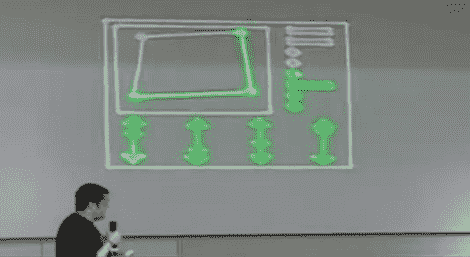

# 使用 OpenLase 开源您的 Rave

> 原文：<https://hackaday.com/2011/01/14/open-source-your-rave-with-openlase/>

毫无疑问，激光投影仪是在你能想象到的任何表面上投射大而明亮图像的好方法。使用足够高质量的投影仪和软件包，可以实时显示出色的图像和可视化效果。openkinect 项目的[marcan]认为，没有任何开源激光投影包可以满足他的需求，所以从逻辑上讲，他决定[编写自己的](http://marcansoft.com/blog/2010/11/openlase-open-realtime-laser-graphics/)。因为[自制的](http://hackaday.com/2010/08/22/another-home-built-laser-projector/)激光投影仪经常使用 PC 的音频输出端口，所以在 JACK unix sound 软件上构建框架来控制硬件非常有意义。OpenLase 包括用于音频可视化、2D 和 3D 游戏的插件，以及将视频流实时转换为激光格式的插件。

请务必查看休息后[marcan]的[混沌通信大会](http://events.ccc.de/congress/2010/wiki/Welcome)演示，以及他网站上的所有额外演示视频。