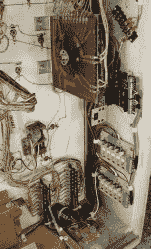
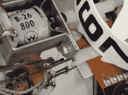
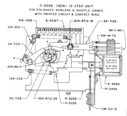

# 原子弹球钟

> 原文：<https://hackaday.com/2011/01/14/atomic-pinball-clock/>

[马克·吉布森]给我们发了一大堆他的作品的细节，[一个使用弹球机的 WWVB 原子钟。这是一台旧机器的直立部分，它使用机电显示器而不是数字电子设备。它又大又吵，看着它跑可能会让你有点头晕。幸运的是，他在视频中展示了它在内部和外部的工作原理。](http://hosted.hackaday.com/atomic-pinball-clock.pdf)

花了一点时间来探测控制显示器的继电器的连接。在那里，他使用光隔离技术用 Arduino 驱动它们。有了这个障碍之后，[马克]开始着手增加原子钟的精确度。他选择了一个 WWVB 模块，并把它添加到组合中。

查看上面链接的 PDF 格式的他的构建日志。他不厌其烦地解释原始部件是如何工作的，以及他在原型制作过程中使用的流程。为了获得更多有趣的细节，我们在休息后增加了一个照片库和他的视频。

没有从这个项目中获得足够的弹球好处？看看这个[数字气体等离子显示器](http://hackaday.com/2010/08/28/gas-plasma-pinball-display/)，它是从一个更现代的弹球机中提取并重新使用的。哦，还有总是有[比尔·帕克斯顿弹球](http://hackaday.com/2010/03/17/bill-paxton-pinball/)。

[https://www.youtube.com/embed/0hFOIy-oxUw?version=3&rel=1&showsearch=0&showinfo=1&iv_load_policy=1&fs=1&hl=en-US&autohide=2&wmode=transparent](https://www.youtube.com/embed/0hFOIy-oxUw?version=3&rel=1&showsearch=0&showinfo=1&iv_load_policy=1&fs=1&hl=en-US&autohide=2&wmode=transparent)

