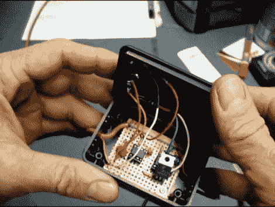

# 价值 20 美元的喷油器测试仪

> 原文：<https://hackaday.com/2011/01/16/20-fuel-injector-tester/>

[Dino]是一名汽车修理工，他需要一种测试喷油器的方法。市面上的工具起价远远超过 100 美元，而且还会继续上涨，但他自己做的工具价格约为 20 美元。

喷油器中有一个需要测试的线圈。他的设计需要一系列 0.008 毫秒的脉冲来测试线圈。他首先设置了一个 555 定时器来输出一秒钟的脉冲。该信号被馈入第二个 555 芯片，该芯片输出 0.008 个脉冲，进而驱动一个 MOSFET 开关线圈。要使用它，[Dino]连接到 12V 工作台电源和注射器，使用一个按钮开始测试。休息之后看他解释视频中的设置。

[https://www.youtube.com/embed/e5Dyr34qd_k?version=3&rel=1&showsearch=0&showinfo=1&iv_load_policy=1&fs=1&hl=en-US&autohide=2&wmode=transparent](https://www.youtube.com/embed/e5Dyr34qd_k?version=3&rel=1&showsearch=0&showinfo=1&iv_load_policy=1&fs=1&hl=en-US&autohide=2&wmode=transparent)