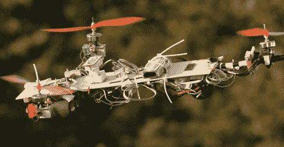

# 带全自动驾驶仪的三旋翼直升机

> 原文：<https://hackaday.com/2011/01/17/tri-rotor-helicopter-with-full-autopilot/>

四轴飞行器靠边站，这是[一架我们认为你会喜欢的三旋翼直升机](http://vicacopter.com/vika1.php)。机身由胶合板和碳纤维杆制成，保持足够轻，只需 3 个马达就可以轻松提起，同时确保力量不会将飞机撕裂。三个陀螺仪、两个加速度计、三个磁力计和一个 GPS 模块一起用于自动驾驶系统。有很多很棒的图片和视频，但我们最喜欢的是，在休息后嵌入的，显示了三架直升机在空中使用光和相机曝光技巧编写信息，类似于这个[地面三轮车](http://hackaday.com/2009/12/28/lightdrawing-robot/)。

 <https://www.youtube.com/embed/7TZzM5YdKE4?version=3&rel=1&showsearch=0&showinfo=1&iv_load_policy=1&fs=1&hl=en-US&autohide=2&wmode=transparent>

 
[谢谢赫南迪]
 </body> </html>