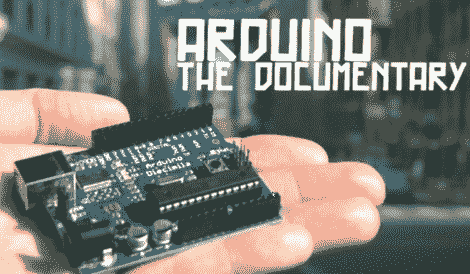

# 阿尔杜伊诺纪录片

> 原文：<https://hackaday.com/2011/01/19/arduino-the-documentary/>

我们终于有时间看了[“Arduino 纪录片”](http://arduinothedocumentary.org/)，这是一部值得称赞的电影。我们喜欢什么？这是一部关于开源硬件的纪录片，那么*不*喜欢什么呢？你将听到 Arduino 团队如何[成立的故事，以及他们从设计到生产的过程。还有对早期采用者的采访，我们甚至发现](http://www.arduino.cc/playground/Main/People) [Sparkfun](http://www.sparkfun.com/) 放弃了销售原始通孔套件版本主板的机会。它制作精良，感谢知识共享许可，你可以免费下载，或者休息后在这里观看嵌入版本。只有 28 分钟的精彩片段，所以[完成那个特殊的时钟](http://hackaday.com/2011/01/18/the-lunchtime-clock-gives-you-12-extra-minutes/)并在今天午餐时观看它。

[https://player.vimeo.com/video/18539129](https://player.vimeo.com/video/18539129)