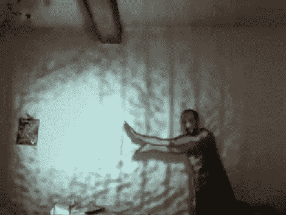

# 投影仪技巧利用 Kinect 3D 映射

> 原文：<https://hackaday.com/2011/01/19/projector-tricks-make-use-of-kinect-3d-mapping/>

[不要停止时钟]正在用投影仪、照相机和 Kinect 做一些工作。他的成就令人印象深刻，[结合三者用你的身体操纵光](http://vimeo.com/18713117)。上图是街霸视频游戏中[哈都肯](http://hackaday.com/2010/12/13/shooting-fireballs-from-your-wrists-hadouken/)的一种更安全的再现，将光而不是火投射到房间的另一边。这将在休息后的视频结尾，但首先他将展示该系统的核心功能。你可以举起你的手，挥动它，把它变成一个光源。换句话说，投影仪将在你的手上发光，移动它，并根据手在 3D 空间中的位置来控制强度。由于 Kinect 会将相当精确的数据发送回计算机，因此投影图像会被修剪为与您的手和手臂相匹配，而不会溢出到房间的其他地方，直到您将手接触到您想要照亮的表面，或者用手指或手腕轻推光源。乍一看，这似乎微不足道，但我们发现投影仪的对准和图像更新的速度令人印象深刻。

<https://player.vimeo.com/video/18713117>

 
 
 
[谢谢瓦西里]
 </body> </html>