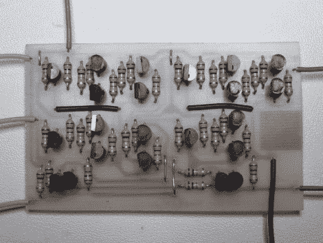

# 中间概念:构建分立晶体管门

> 原文：<https://hackaday.com/2011/01/20/intermediate-concepts-building-discreet-transistor-gates/>

[Simon Inns]整理了一堂数字逻辑课，向你展示如何用晶体管建造自己的门。上图是他自己制作的全加器，然后和其他全加器组合在一起，创造了一台 4 位计算机。

不知道全加器是什么？这正是他的文章的目的，将教你二进制数学以及如何用硬件计算。在那一页中，可能至少有一周的学习价值，休息后，这一页被进一步浓缩成五分钟的视频。虽然自己构建这个硬件是一种很好的学习方式，但是也有很多出错的空间。你可以考虑在类似于 [Atanua](http://hackaday.com/2008/12/18/7400-series-logic-simulator/) 的模拟器程序中构建这些电路，在那里你可以使用逻辑门符号，使用虚拟按钮和 led 作为输出。一旦你知道你在用模拟器做什么，你就会更有信心开始像西蒙设计的那样锻炼身体。

觉得这个项目有点太超前了？查看[我们的初学者概念文章](http://hackaday.com/tag/beginner-concepts/)来帮助你跟上速度。

 <https://www.youtube.com/embed/xISG4nGTQYE?version=3&rel=1&showsearch=0&showinfo=1&iv_load_policy=1&fs=1&hl=en-US&autohide=2&wmode=transparent>

 
[谢谢蓝色幽灵]
 </body> </html>