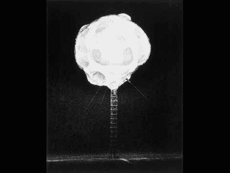

# Rapatronic 快门；拍一张原子弹的照片

> 原文：<https://hackaday.com/2011/01/20/rapatronic-shutter-snap-a-pic-of-an-atomic-bomb/>

我们以前从未真正想过这个问题，但是[这篇关于 Rapatronic 快门的文章](http://edgerton-digital-collections.org/techniques/rapatronic-shutter)回答了如何拍摄原子弹爆炸的问题。帖子包括一段麻省理工学院的视频，视频中[[查尔斯·威科夫](http://en.wikipedia.org/wiki/Charles_Wyckoff)解释了他和[哈罗德·艾杰顿]如何开发了[Rapatronic 相机](http://en.wikipedia.org/wiki/Rapatronic_camera)。它被设计用来拍摄基于零点时间的照片，以炸弹实际爆炸前发出的 X 射线透射为标志。这个脉冲由延迟电路上的光传感器接收，允许非常精确的曝光时间。同时使用了许多这样的摄像机，所有这些摄像机都有略微不同的延迟，以便可以观看图像，从而显示在爆炸的每个阶段发生了什么。

[Thanks Petrus]