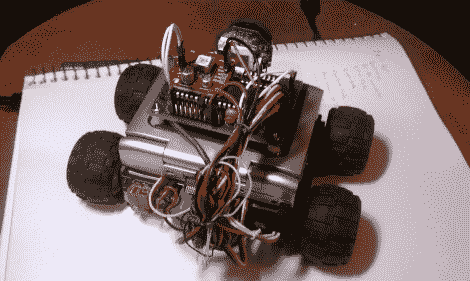

# Zipitbot

> 原文：<https://hackaday.com/2011/01/20/zipitbot/>

Zipit 很好，但它自己哪儿也去不了。添加一些电机和一个微控制器解决了这个问题，现在他有了一个叫做 Zipitbot 的小机器人。顶部是一个 dsPIC 板，通过 I2C 总线与 Zipit 通信。四个伺服电机为车轮提供充足的动力，它们之间还有一些额外的电池组。

由于 Zipit 运行的是 Linux，并且已经有了 WiFi 硬件，所以添加互联网控制并不太难。考虑到这一点，前面有一个网络摄像头，可以在远程控制时播放视频。休息之后，请观看几个视频。

桌面测试

 <https://www.youtube.com/embed/Enbi6-u9Wm0?version=3&rel=1&showsearch=0&showinfo=1&iv_load_policy=1&fs=1&hl=en-US&autohide=2&wmode=transparent>

 
使用流式视频进行互联网控制
 <iframe class="youtube-player" width="800" height="480" src="https://www.youtube.com/embed/ODHTykY63E8?version=3&amp;rel=1&amp;showsearch=0&amp;showinfo=1&amp;iv_load_policy=1&amp;fs=1&amp;hl=en-US&amp;autohide=2&amp;wmode=transparent" allowfullscreen="true" style="border:0;" sandbox="allow-scripts allow-same-origin allow-popups allow-presentation"/> 
[感谢 Rkdavis]
 </body> </html>