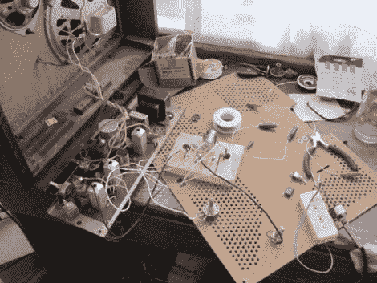

# 来自 Junk Hi-fi 的吉他电子管放大器

> 原文：<https://hackaday.com/2011/01/20/guitar-tube-amp-from-junk-hi-fi/>

[特里斯坦钱伯斯]拿起一个旧音箱一些朋友在院子里出售。它没有任何输入，也没有像收音机那样的调谐旋钮，所以它最初是用来做什么的还是个谜。[特里斯坦]找出电路，并找出他可以输入音频信号的地方，这使他能够连接一个 iPod，但它是单声道的，不是很大声。他从网上找到一个原理图，并据此制作了自己的真空管前置放大器，这样他就可以和电吉他一起使用了。正如休息后的视频所示，盒子不仅发出一些很好的声音，而且声音也很大。

[https://www.youtube.com/embed/6V6ZA5AoivM?version=3&rel=1&showsearch=0&showinfo=1&iv_load_policy=1&fs=1&hl=en-US&autohide=2&wmode=transparent](https://www.youtube.com/embed/6V6ZA5AoivM?version=3&rel=1&showsearch=0&showinfo=1&iv_load_policy=1&fs=1&hl=en-US&autohide=2&wmode=transparent)