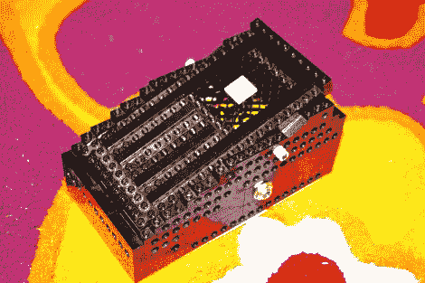

# 乐高哇哇踏板

> 原文：<https://hackaday.com/2011/01/20/lego-wah-wah-pedal/>

这是[克里斯·蒙克]制作的吉他哇哇踏板。在里面你会发现一个电路板，他根据这个设计蚀刻并组装了，但是他选择用乐高建造房屋。休息后的视频让你知道它听起来像什么，但对于那些赤脚踩在乐高积木上的人来说，他的踏板重击声可能会让你退缩！

为了控制声音，踏板在一个中心枢轴上前后摇动，如上图所示，一个灰色的“螺母”从框架的侧面伸出。里面有一个乐高齿轮系统，转动一个微调按钮来改变声音。这可能会很好地配合[你一起黑掉的吉他放大器](http://wp.me/pk3lN-8Dj)。

 <https://www.youtube.com/embed/_3T1LXIrn_E?version=3&rel=1&showsearch=0&showinfo=1&iv_load_policy=1&fs=1&hl=en-US&autohide=2&wmode=transparent>

 </body> </html>