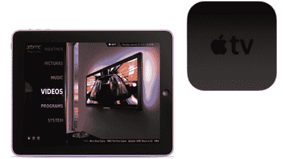

# 我们敬爱的 XBMC 登陆 IOS 设备

> 原文：<https://hackaday.com/2011/01/21/our-beloved-xbmc-hits-ios-devices/>

对于那些一直渴望释放 Apple TV 2 功能的人来说，等待已经结束了。 [XBMC 现可用于 iOS 设备](http://xbmc.org/theuni/2011/01/20/you-asked-for-it-xbmc-for-appletv2-ipad-iphone4/)。这不仅限于基于 ARM 的微型机顶盒，而是扩展到整个家庭，包括 iPad 和 iPhone 4。包括播放高达 1080p 的高清视频而无需转码的能力。但我们认为最好的功能可能是 XBMC 能够从任何操作系统轻松地通过网络传输媒体。再见 iTunes 共享。

如果您习惯使用 SSH 来处理越狱设备，ATV2 的安装会很容易，因为已经有了一个安装源库。 [iPad 和 iPhone 4 更简单](http://wiki.xbmc.org/index.php?title=Install_XBMC_on_iPhone/iPad)，只需在 Cydia 中添加库并安装即可。哇，当[我们第一次看到新一代 ATV](http://hackaday.com/2010/09/30/the-new-apple-tv/) 时，我们真的认为它需要更长的时间才能看到我们最喜欢的开源媒体客户端的端口。感谢 XBMC 团队！