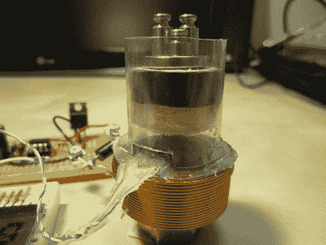

# 磁性数字秤

> 原文：<https://hackaday.com/2011/01/21/magnetic-digital-scale/>

在上面你可以看到[一个螺线管被用作数字标尺](http://dev.frozeneskimo.com/embedded_projects/levitating_digital_scale)。底座中线圈产生的磁场使上面的平台悬浮起来，待测的负载就放在上面。这个浮动平台中有一个永久磁铁，悬浮在底座中的霍尔效应传感器上方。当磁铁和传感器之间的距离改变时，可测量的磁场也会改变。霍尔效应传感器是线性的，因此测量值很容易与重量相关联。在休息后的视频中，[Vsergeev]展示了该设备使用测试砝码来展示其 0.5 克的分辨率。他认为，通过一些硬件改进，他可以轻松达到 0.1g 的精度。

 <https://www.youtube.com/embed/qcosP8ycwFo?version=3&rel=1&showsearch=0&showinfo=1&iv_load_policy=1&fs=1&hl=en-US&autohide=2&wmode=transparent>

 </body> </html>