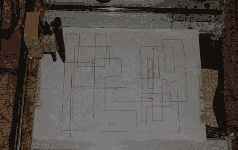

# 高压蚀刻草图

> 原文：<https://hackaday.com/2011/01/22/high-voltage-etch-a-sketch/>

当你把一个简单的 X/Y 绘图仪、回扫变压器和不健康的对安全的漠视混合在一起，你会得到什么？可能是世界上最危险的[巨型蚀刻素描](http://www.instructables.com/id/50000-volt-etch-a-sketch/)！[Kalboon]从制造不精确的 X/Y 移动设备开始，类似于 CNC 机器设置，但不太强调精度。这个钻机由一些常见的可回收材料驱动，包括一台旧扫描仪、一辆遥控车和一些业余爱好伺服系统。我们喜欢这种方法，因为大多数这些材料可以从零件箱、剩余销售或 craigslist 上找到，几乎没有实际成本。[反激](http://en.wikipedia.org/wiki/Flyback_transformer)变压器来自一台旧电视或显示器，尽管如果你有~~常识~~安全顾虑，我们会建议你只安装一个干擦标记和一块干擦板来替代高压位。对于想要一个低成本引入项目来制作 CNC 或 Makerbot 风格构建的人来说，这是一个不错的起点。