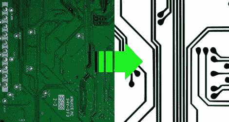

# 对 PCB 进行逆向工程

> 原文：<https://hackaday.com/2011/01/22/reverse-engineering-a-pcb/>

偶尔一个设备坏了，缺陷很明显。无论是熔断的保险丝还是有缺陷的电容器，通常容易看到的东西很容易修复。当问题更加微妙时，或者当执行一些更高级的任务时，如为设备添加功能，需要更多关于电路板的知识。虽然 PCB 的较低层可能隐藏着一些细节，但通常只需了解安装的元件和外层的布局，就足以制作出一个粗略的器件原理图。[Throbscottle]已经整理了一个[优秀的指南](http://www.instructables.com/id/How-to-reverse-engineer-a-schematic-from-a-circuit/)来按程序分解一张董事会的照片，并把它变成有用的东西。该指南利用了一些开源图像处理软件，如[GIMP](http://www.gimp.org/)、 [Inkscape](http://inkscape.org/) 和 [Dia](http://live.gnome.org/Dia) ，所有这些软件都可以广泛获得。请记住，这种逆向工程可能是一个耗时的过程，但几乎肯定会奖励那些足够耐心的工作通过它。

【感谢所有发这个进来的人！]