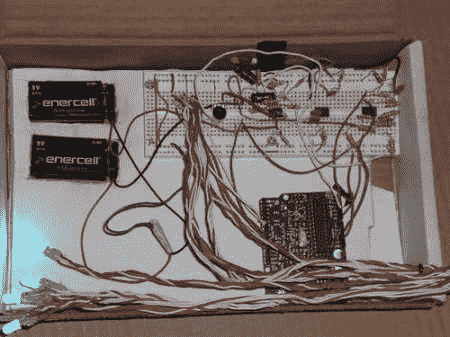

# 把音乐变成灯光秀

> 原文：<https://hackaday.com/2011/01/22/turning-music-into-a-light-show/>

[nickinoki]使用一些放大器和 arduino 制作了一个[灯光秀](http://www.instructables.com/id/Sound-into-Light-shows/#step1)。首先，他基于 LM386 音频放大器创建了一个麦克风电路。在第二次放大麦克风的输出后，他使用三个带通滤波器来阻止除少数所需频率之外的所有频率到达 arduino。只让几个频率通过 arduino 就能确定歌曲在较高或较低频率下是否更响亮。然后，他使用三个模拟输入创建了一个在 arduino 上生成灯光表演的方案。虽然他无法用他的带通滤波器实现精确的目标频率，但它们工作得足够好，让他成功地产生了光表演。