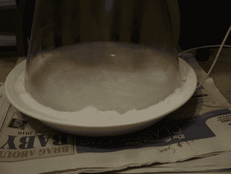

# 你自己的云室

> 原文：<https://hackaday.com/2011/01/23/your-very-own-cloud-chamber/>

[肯尼斯]和[杰夫]花了一个周末[建造一个云室](http://kennethfinnegan.blogspot.com/2010/12/build-your-own-cloud-chamber.html)。这是[一个持续轰击地球的辐射粒子探测装置](http://en.wikipedia.org/wiki/Cloud_chamber)。它的工作原理是创造一个过饱和酒精蒸汽的环境，当被穿过容器的粒子撞击时，蒸汽会凝结，留下一条细细的痕迹。这是用异丙醇和干冰廉价完成的。他们已经有了一个烧杯，经过几次尝试，他们发现干冰作为烧瓶的底部效果最好。在容器的底部添加了一张黑色的纸，以帮助提高寻找冷凝物时的对比度。他们试验了几种不同的方法来加热酒精，包括用电阻制成的浸入式加热器。

有一段视频解释了我们在休息后植入的装置。在视频中很难看到粒子旅行的证据，但这也是你应该亲自尝试一下的原因。

 <https://www.youtube.com/embed/BS1XJ1OVwfs?version=3&rel=1&showsearch=0&showinfo=1&iv_load_policy=1&fs=1&hl=en-US&autohide=2&wmode=transparent>

 </body> </html>