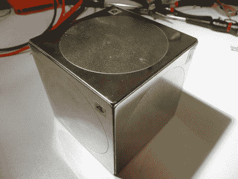

# 打开冰袋

> 原文：<https://hackaday.com/2011/01/24/roll-the-dicey/>

我们遇到的大多数与骰子相关的攻击都与伪随机数生成有关，但今天我们看到了一些不同的东西。这个看起来光滑的巨型骰子实际上是一个通过秘密旋转序列打开的奖品盒。使用加速度计和带有亚微型伺服机构的 ATmega 328 来控制锁定机构。担心电池没电，永远失去你的宝贝？好消息！电池是可以使用的，不会泄露里面的秘密。

事实证明，这是对来自同一个实验室的[早期项目](http://deddieslab.blogspot.com/2010/09/for-friends-wedding-we-had-to-find-way.html)的更新，所以一定要检查一下，看看这个构建来自哪里。代码可供任何想自己制作的人使用，还有一份有用的零件清单。

[via [被黑的小工具](http://hackedgadgets.com/2011/01/22/hide-goodies-in-a-secret-dice-atmega88-microcontroller-based/)