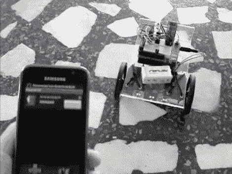

# 阿马里诺让机器人控制机器人变得轻而易举

> 原文：<https://hackaday.com/2011/01/24/amarino-makes-android-controlled-robots-a-snap/>

[卢卡斯·弗拉戈梅尼]正在用他的安卓手机上的加速度计控制这个机器人。他本可以通过[我们的 Android 教程](http://hackaday.com/2010/07/12/android-development-101-%E2%80%93-a-tutorial-series/)开发一个定制的应用程序，但他走了一条更短的路线，使用了 [Amarino，一个“Android meets Arduino”工具包](http://hackaday.com/2010/06/15/android-meets-arduino/)来为他做这件事。[卢卡斯]组合了一个 Arduino，一个 BlueSMiRF 蓝牙调制解调器和两个伺服电机来建造他的机器人。Amarino 让他连接到蓝牙调制解调器，并通过连接发送传感器数据。在这种情况下，他选择使用的只是加速度计，但他也可以使用触摸屏或手持设备提供的任何其他传感器。使用这个代码包使他快速启动并运行，只需要他编写自己的代码来将接收到的信号转换为伺服电机控制例程。休息之后看看它的实际效果。

[https://www.youtube.com/embed/AAGCgGwvLPM?version=3&rel=1&showsearch=0&showinfo=1&iv_load_policy=1&fs=1&hl=en-US&autohide=2&wmode=transparent](https://www.youtube.com/embed/AAGCgGwvLPM?version=3&rel=1&showsearch=0&showinfo=1&iv_load_policy=1&fs=1&hl=en-US&autohide=2&wmode=transparent)