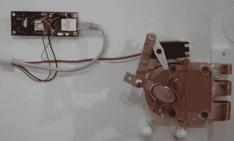

# 通过短信实现无钥匙进入

> 原文：<https://hackaday.com/2011/01/24/keyless-entry-via-sms/>

[比利]的工作得到了新的钥匙，他不想随身携带。相反，他建造了这个系统，通过短信来[开门。它基于一个驱动伺服电机的](http://anerroroccurredwhileprocessingthisdirective.com/2011/01/01/opening-a-door-via-text-message/)[喷丝头网络服务器](http://www.parallax.com/Store/Microcontrollers/PropellerDevelopmentBoards/tabid/514/ProductID/710/List/0/Default.aspx?SortField=ProductName,ProductName)。他安装了一个管道吊架，给锁的把手增加了一些杠杆作用。我们很惊讶，伺服有足够的权力来做这项工作，但休息后的视频显示，真的没有问题。在通信方面,[比利]设置了[Twilio](http://hackaday.com/2010/05/09/twilio-adds-touch-tone-telephone-control-for-arduino/)来等待发件人名单上的短信，然后用一个 HTML 表单向网络服务器发出解锁命令。

 <https://www.youtube.com/embed/eexlYrESdP8?version=3&rel=1&showsearch=0&showinfo=1&iv_load_policy=1&fs=1&hl=en-US&autohide=2&wmode=transparent>

 
[通过<a href="http://blog.makezine.com/archive/2011/01/sms-enabled_deadbolt.html" target="_blank">使</a>
 </body> </html>