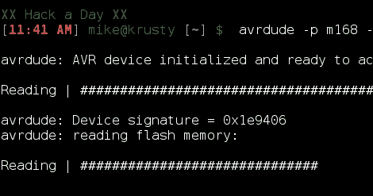

# AVR:关于闪存的事实

> 原文：<https://hackaday.com/2011/01/24/avr-the-facts-about-flash-memory/>

这里有一个很好的关于读写 AVR 闪存的小讨论，这是[Windel]放在一起的。他正在使用系统内编程器从 ATmega328 读取闪存，使用 AVRdude，我们在[AVR 编程教程](http://hackaday.com/2010/10/23/avr-programming-introduction/)中使用的编程软件。他讲述了命令的细节，这可能是有用的，并以从芯片读回代码所涉及的问题结束。我们最近用 LED 灯泡的[进行了尝试，但没有成功，因为 ATtiny13 芯片上的锁定位已经被设置，以保护固件免受我们窥探。希望这些方法能给你带来更多的好运。](http://hackaday.com/2010/12/09/part-2-help-me-reverse-engineer-an-led-light-bulb/)