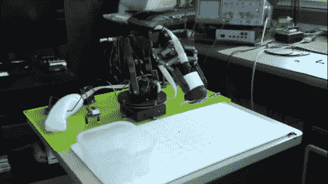

# 卡住手爪完成机器人毒贩

> 原文：<https://hackaday.com/2011/01/25/jamming-gripper-completes-robot-drug-dealer/>

这里有一个便宜的方法来制作你自己的卡住的夹子。[Steve Norris]将一个机器人手臂和一些便宜的物品结合在一起，实现了与[原版](http://hackaday.com/2010/10/26/robot-gripper-uses-coffee-to-pick-up-anything/)相似的效果。很像[的最后一个 DIY 版本](http://hackaday.com/2010/11/04/diy-coffee/)，他从一个气球和一些咖啡渣开始，但是他没有用自己的身体作为真空泵，而是采购了一个 [Reynolds Handi-Vac](http://www.reynoldspkg.com/reynoldskitchens/handi_vac/en/home.asp) ，一个便宜的食品真空密封器。它用一些塑料管连接到气球上，吸出所有的空气，将咖啡渣锁在一个物体周围，以便牢牢抓住。收支平衡后的视频显示，抓爪拿起两片阿司匹林。起初，我们认为一旦空气被抽走，伺服电机就会被用来密封管道。相反，它覆盖了管道上的一个洞，当需要放下一个物体时，这个洞会打破真空。

 <https://www.youtube.com/embed/quvRo9pvRdI?version=3&rel=1&showsearch=0&showinfo=1&iv_load_policy=1&fs=1&hl=en-US&autohide=2&wmode=transparent>

 
[via <a href="http://www.botjunkie.com/2011/01/25/homebrew-balloon-gripper-takes-two-tylenol-calls-it-a-day/" target="_blank">机器人迷</a>
 </body> </html>