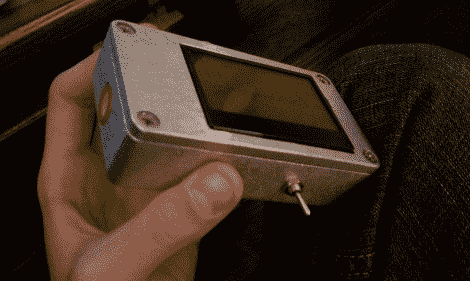

# 不准确的酒精测试仪仍然很好

> 原文：<https://hackaday.com/2011/01/25/inaccurate-breathalyzer-is-still-quite-nice/>

当然，[亨特·斯科特的] [呼气测醉器只能区分锤子和清醒的](http://hscott.net/projects/breathalyzer/)，但看看它出来多好。他使用的是 MQ-3 酒精传感器，[从以前的项目](http://hackaday.com/2010/03/07/dont-worry-occifer-there-is-no-blood-in-my-alchohol/)，我们知道很难精确校准。但是如果你想摆弄嵌入式系统，你必须有一个目标。[Hunter]选择了一个华丽的铝制项目外壳，为照明增加了一个大的 LCD 显示屏。底部的开关可在开、关和充电模式之间选择。他用 Adafruit 的 USB 充电器给里面的锂电池充电。除了传感器从升压转换器获得 5V 电源之外，一切都在 3.3V 下运行。Arduino 是一个将所有东西整合在一起的大脑。

见[猎人的]视频描述的项目嵌入后休息。

[https://www.youtube.com/embed/JRFDamwBsAs?version=3&rel=1&showsearch=0&showinfo=1&iv_load_policy=1&fs=1&hl=en-US&autohide=2&wmode=transparent](https://www.youtube.com/embed/JRFDamwBsAs?version=3&rel=1&showsearch=0&showinfo=1&iv_load_policy=1&fs=1&hl=en-US&autohide=2&wmode=transparent)