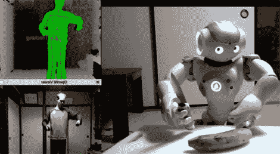

# ROS 获得全身遥测技术

> 原文：<https://hackaday.com/2011/01/26/ros-gains-full-body-telemetry/>

[Taylor Veldrop]一直在玩一个 [NAO 机器人和 ROS，与 Kinect](http://www.robots-dreams.com/2011/01/humanoid-robot-navigation-teleoperation-using-nao-and-kinect-video.html) 混合使用，以获得一些相当惊人的结果。上一次我们看到 ROS 和 Kinect 所做的工作，它允许使用 PR2 进行一些[基本遥测。[泰勒]更进了一步，允许全身控制](http://hackaday.com/2010/11/23/pr2-kinect/) [NAO](http://www.robots-dreams.com/2011/01/aldebaran-nao-robot-developer-program-generates-strong-response-video.html) 机器人。基本的模仿加上一点点自主性，让 NAO 在房间里跟随他的脚步，甚至切香蕉或钉钉子。我们认为这非常令人印象深刻，特别是如果他将它与[运动跟踪立体显示器](http://hackaday.com/2011/01/25/vr-now-with-more-kinect-wiimote-and-vuzix/)混合在一起。休息过后，请继续关注，看看它如何实现这些超酷的壮举。

 <https://www.youtube.com/embed/TmTW61MLm68?version=3&rel=1&showsearch=0&showinfo=1&iv_load_policy=1&fs=1&hl=en-US&autohide=2&wmode=transparent>

 </body> </html>