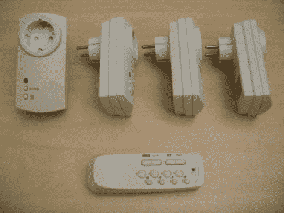

# 逆向工程无线电控制插座

> 原文：<https://hackaday.com/2011/01/26/reverse-engineering-radio-controlled-outlets/>

[Chr]拿起一包[遥控插座，以便对它们进行逆向工程](http://www.instructables.com/id/USB-controlled-home-automation-hack)，并在他自己的项目中建立控制。这些可以插在你家周围的插座上，每个模块内的继电器在收到遥控器的命令后会切换任何插入其中的设备。一旦他打开控制盒，很容易就能找到 RF 模块的数据线，它就在自己的板上。他使用逻辑分析仪从各种按钮按压中捕捉数据，然后花一些时间破译通信协议。他用他所学到的知识将模块和代码卷进一个接口盒，ATmega8 通过 USB 连接，并将命令从计算机传递到射频板。现在他通过一台相当便宜的电脑增加了家庭自动化。休息之后，你可以用智能手机观看插座切换的片段。

那么为什么不直接把遥控器上的按钮插上呢？这个月早些时候，我们当地的黑客空间也尝试了同样的项目[,按钮不仅仅是将一根针拉向地面。它们使用三态逻辑，排列成一个矩阵，用微控制器很难模仿(如果不是不可能的话)。在这两种方法中，分析进入 RF 模块的通信无疑是劳动强度较小的。](http://www.sector67.org/blog/2011/week-in-projects-3/)

[https://www.youtube.com/embed/_Nn7xAD_cVE?version=3&rel=1&showsearch=0&showinfo=1&iv_load_policy=1&fs=1&hl=en-US&autohide=2&wmode=transparent](https://www.youtube.com/embed/_Nn7xAD_cVE?version=3&rel=1&showsearch=0&showinfo=1&iv_load_policy=1&fs=1&hl=en-US&autohide=2&wmode=transparent)