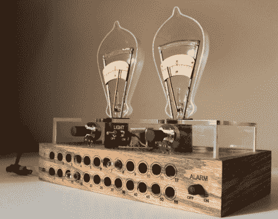

# 爱迪生时钟使用电流表加灯泡来设置闹钟

> 原文：<https://hackaday.com/2011/01/26/edison-clock-uses-ammeter-plus-bulbs-to-set-alarm/>

这是爱迪生时钟，由大卫·科劳兹克设计。它以与万用表时钟相同的方式显示时间，调节两个模拟指针式仪表的功率。使这一个有点不同的特征是警报。你可以看到底座前面的一系列孔。它们每个都有一个小灯泡，对应小时和 5 分钟的增量。插入两个灯泡来设置闹钟时间，并确保闹钟旋钮指向“开”。正如你在上面看到的，闹钟被设置为 8:15。隐藏在上面文章最后一张图片上的是[的 PDF 文件，只是多了一点解释](http://s3images.coroflot.com/user_files/individual_files/366965_xQ3ZdQBsdubO5oSLtgEAEGgMI.pdf)。尽管如此，还是有很多被遗漏了，所以如果你复制这个时钟，我们想知道它。

[通过 [Gizmodo](http://gizmodo.com/5742879/what-is-this-cruel-and-unusual-torture-instrument) 和 [Walyou](http://walyou.com/light-bulb-alarm-clock/)