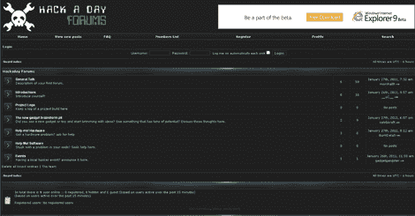

# 官方黑客论坛

> 原文：<https://hackaday.com/2011/01/27/official-hackaday-forums/>

是的，最后，我们[有一个论坛](http://forums.hackaday.com)。我们经常收到关于黑客论坛的请求，包括评论和电子邮件。我们几天前把它投入运营，开始让人们慢慢进入，它还没有完全在我们面前爆炸。请加入我们，帮助建立我们的社区。另外，请注意，现在在右栏上有一个按钮。

一些感兴趣的项目或常见问题的常见答案:

*   不允许非法活动。是的，我们的名字里有“黑”字。这并不意味着我们会为你黑一个网站。(我们每周都会收到这样的请求)。
*   保持适度清洁。当然你可以骂人，这不是一个孩子的网站，但请不要发音/血块。
*   没有人身威胁。
*   会有谷歌广告。我们正在努力平衡工作和娱乐，所以请原谅我们。到目前为止，他们还没有碍事。我们不打算走极端。
*   这将是可读的没有登录。你必须注册才能发布。
*   我们正在解决问题。请向 caleb 报告任何问题@

就这样，享受，文明一点。