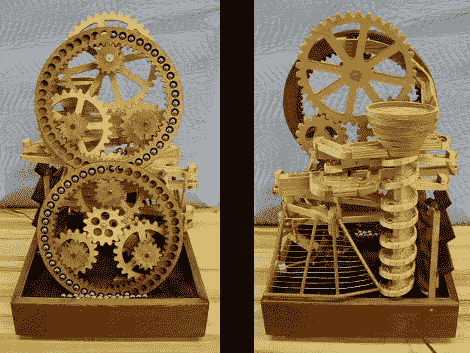

# 5/8″球轴承运动场

> 原文：<https://hackaday.com/2011/01/27/58-ball-bearing-playground/>

这个动态雕塑是滚珠轴承的天堂。他们不仅可以轻松地绕过两个升降轮，还可以越过各种有趣的障碍。第一个是由一个木制花盆制成的漩涡，它将球随机送下两个可能出口中的一个。从那里开始，你就可以享受在人字拖、三分法(在它把所有弹珠都扔出去之前需要三个弹珠的重量)、之字形轨道或十二分机制上的旅程了。我们确信这是一个引人入胜的阅读，但不要错过休息后的视频，在那里[罗纳德·沃尔特]展示了它的行动，并把它拆开来说明各种功能。

如果你想知道所用的数字逻辑术语，我们在过去见过使用这些概念的木制设备。

 <https://www.youtube.com/embed/QzIG9stFXSI?version=3&rel=1&showsearch=0&showinfo=1&iv_load_policy=1&fs=1&hl=en-US&autohide=2&wmode=transparent>

 
[via <a href="http://www.reddit.com/r/gadgets/comments/f9n1k/awesome_marble_machine/" target="_blank"> Reddit </a>
 </body> </html>