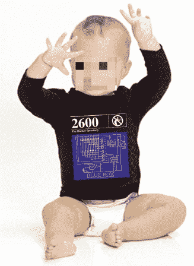

# 《2600》杂志正在出售 20 世纪的过期杂志

> 原文：<https://hackaday.com/2011/01/27/2600-magazine-runs-a-sale-for-the-20th-century-back-issues/>

为了腾出一些仓库空间， [2600 杂志已经将 1984 年至 2000 年各期的价格降至每期 2.5 美元。如果你没有读过黑客季刊《2600》，你真该感到羞耻。拿起一些开始阅读。在黑客和安全相关问题上，它们是任何其他杂志都无法比拟的资源。他们也不掩饰好的部分，他们给出细节，因为他们知道他们在谈论什么。为了进一步证明这一点，我们向您展示上面的图片。是的，这是一个孩子身上的蓝盒子的示意图，是的，你可以在](http://www.2600.com/news/view/article/12052)[他们的商店](http://store.2600.com/shirtsforkids.html)(衬衫)买到。