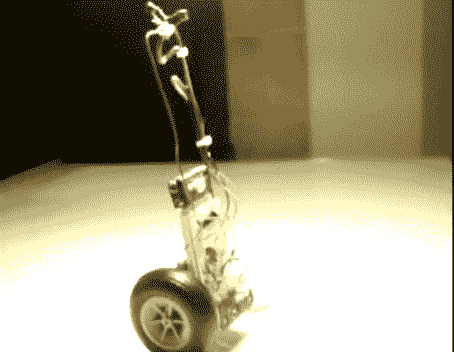

# 基于 555 的平衡机器人

> 原文：<https://hackaday.com/2011/01/27/555-based-balancing-bot/>

[superangryguy]在 Reddit 上的这篇帖子今天引起了我们的注意。他制作了一个[视频，解释如何建造平衡机器人](http://www.reddit.com/r/electronics/comments/f7p9l/how_to_build_a_simple_analog_balancing_robot_with/)的基本知识，重点是一个基于 555 定时器的机器人。他有两个主要版本，一个基于 555，另一个基于两个晶体管。他说基于 555 的更容易制造。这一切都是因为即将到来的 [555 计时器大赛](http://hackaday.com/2011/01/25/555-design-contest-win-1500-in-prizes/)而发生的。如果你去 Reddit 贴吧，你可以得到两个版本的示意图，以及他计划为比赛建造什么。休息之后你可以看视频。

[https://www.youtube.com/embed/Y-afnY32RrY?version=3&rel=1&showsearch=0&showinfo=1&iv_load_policy=1&fs=1&hl=en-US&autohide=2&wmode=transparent](https://www.youtube.com/embed/Y-afnY32RrY?version=3&rel=1&showsearch=0&showinfo=1&iv_load_policy=1&fs=1&hl=en-US&autohide=2&wmode=transparent)