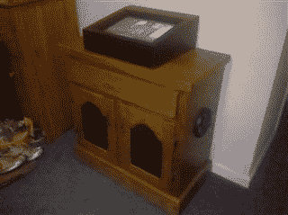

# 触摸屏点唱机

> 原文：<https://hackaday.com/2011/01/28/touch-screen-jukebox/>

不到 24 小时前，我们的论坛开始“直播”,我们已经为头版准备好了第一个项目。[Elementix]向我们展示了他的[触摸屏点唱机](http://forums.hackaday.com/viewtopic.php?f=3&t=61)版本。他用各种各样的汽车音频扬声器和放大器连接到一台 120 存储容量的旧奔腾 4 电脑上，组装了一个底柜。触摸屏是易趣上找到的，他为那部分做了一个定制的外壳。对于界面，他从“Jukebox Arcade”开始，这是 mame cabinets 的点唱机前端，但他发现他可以轻松地操纵布局，因为它使用 xml 文件进行设置。经过一些试验和错误，以及与[和 gimp](http://www.gimp.org/) 的一些工作，他得到了他想要的样子。如果你还没有去过，你真的应该去看看我们的[新论坛](http://forums.hackaday.com)。