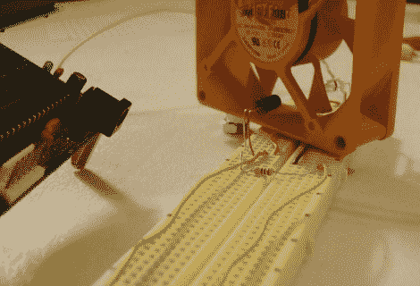

# 计算转速的简单传感器

> 原文：<https://hackaday.com/2011/01/28/simple-sensors-to-calculate-rpm/>

想知道如何使用微控制器计算每分钟转数吗？这个项目向你展示了如何利用红外线发射器、探测器和电脑风扇。当风扇叶片旋转时，它们会破坏发射器和接收器之间的红外线光束。这会在接收器电路上产生一个波形，可以很容易地用来触发任何微控制器中的中断。在这种情况下，PIC 18F452 监控检测器信号的上升沿。通过测量中断之间的时间数据，可以确定周期并计算 RPM。休息之后你可以看到一个测试平台的视频。

那么你能用这个做什么呢？这是大多数[旋转视点显示器](http://hackaday.com/2010/11/13/lots-of-spinning-pov-goodness/)用来稳定显示的方法。你不会局限于一个红外传感器，但可以使用霍尔效应传感器在同样的基本时尚。

[https://www.youtube.com/embed/MKEG8qzZYN4?version=3&rel=1&showsearch=0&showinfo=1&iv_load_policy=1&fs=1&hl=en-US&autohide=2&wmode=transparent](https://www.youtube.com/embed/MKEG8qzZYN4?version=3&rel=1&showsearch=0&showinfo=1&iv_load_policy=1&fs=1&hl=en-US&autohide=2&wmode=transparent)

[via [被黑的小工具](http://hackedgadgets.com/2011/01/27/diy-pic-microcontroller-based-digital-tachometer-project/)