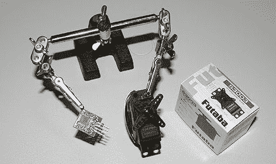

# OpenServo 项目

> 原文：<https://hackaday.com/2011/01/28/the-openservo-project/>

当谈到在项目中使用伺服系统时，便宜的和昂贵的高功率和精密模型之间有明确的区别。OpenServo 项目给了你几个选项来增强你的伺服体验。通过用基于[熟悉的](http://hackaday.com/category/arduino-hacks/)微控制器的新控制板替换控制板，可以获得一套全新的[功能](http://www.openservo.com/DocAboutOpenServo)。对于那些需要像这样的伺服系统的人来说，你可以购买预建的替换板(不幸的是，现在已经卖完了)，或者根据提供的原理图、BOM 和源代码构建自己的板。