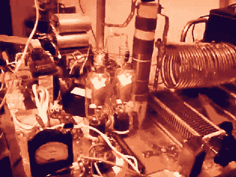

# 构建线性放大器原型

> 原文：<https://hackaday.com/2011/01/28/building-linear-amplifier-prototypes/>

我们对这个主题知之甚少，但希望[Bob4analog]这次能帮助我们多学一点。他正在看起来像中密度纤维板的东西上建造他自己的线性放大器。这是一个不断发展的设计，休息后的两个视频展示了两个不同的迭代。他回收了几个组件，比如微波变压器，还建造了自己的组件，比如上图中电子管右边的板状扼流圈。在待机状态下，功放的电压为 2800 伏，在开机前加热灯丝。

他对此有什么计划？问得好，但驱动远程发射器似乎绰绰有余。

第一次迭代:两根管子

 <https://www.youtube.com/embed/zB8cVwZyVmc?version=3&rel=1&showsearch=0&showinfo=1&iv_load_policy=1&fs=1&hl=en-US&autohide=2&wmode=transparent>

 
第二次迭代:单管
 <iframe class="youtube-player" width="800" height="480" src="https://www.youtube.com/embed/zB8cVwZyVmc?version=3&amp;rel=1&amp;showsearch=0&amp;showinfo=1&amp;iv_load_policy=1&amp;fs=1&amp;hl=en-US&amp;autohide=2&amp;wmode=transparent" allowfullscreen="true" style="border:0;" sandbox="allow-scripts allow-same-origin allow-popups allow-presentation"/> 
[通过<a href="http://blog.makezine.com/archive/2011/01/breadboard_linear_amplifiers.html" target="_blank">使</a>
 </body> </html>