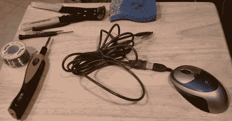

# 鼠标中的安全审计工具包

> 原文：<https://hackaday.com/2011/01/29/security-audit-kit-in-a-mouse/>

有时候，随身携带一整套工具来解决问题会有所帮助，有时候，谨慎行事也会有所帮助。[StenoPlasma]采用了这些方法中的后一种方法，将一个 USB 集线器、一个 16 GB 闪存驱动器和一个基于 Atheros 的 USB 无线适配器塞进了一个普通的 USB 鼠标中，以在鼠标中制作一个 Linux 可启动系统。因为他选择了 Atheros 适配器，所以他还能够使用 Aircrack-ng 等工具进行数据包注入，这在安全审计或(白帽)黑客攻击的情况下非常有用。

这是我们仅有的一张照片，所以有可能这只鼠标只是一只鼠标，然而我们知道[StenoPlasma]声称的 100%可能，所以我们给他一个假定，并希望这能激励其他人来破解你自己的鼠标套件。休息后，请务必查看完整的零件清单。

**零件:**

*   Targus USB 2.0 4 端口 Bend-a-Hub(剥离并重新焊接)
*   belkin USB 10’延长线(带有 USB 延长线，便于我更改线缆长度)
*   IOGEAR Atheros 无线 B/G 可注射破解适配器
*   海盗船航海家迷你 16 GB 拇指驱动器
*   罗技 MX310 有线光电鼠标