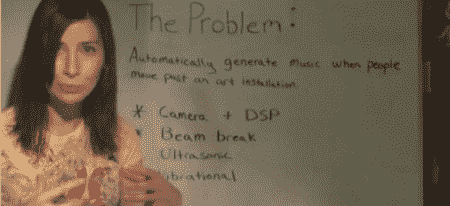

# 杰瑞有自己的节目了吗？

> 原文：<https://hackaday.com/2011/01/30/jeri-getting-her-own-show/>

[Jeri Ellsworth]对这个新机会感到非常兴奋。她给我们发了一个“[试播视频](http://www.element-14.com/community/groups/jeri-ellsworth?view=video)，所以我们认为会有更多的试播视频。在试播中，她解释了如何建立一个音乐艺术装置，当观众就位时，它将播放音乐。她介绍了几种不同的方法来检测人的存在，最终采用 PIR 传感器进行检测。我们迫不及待地想看到这个节目的走向，但我们希望她继续做她自己的黑客视频。