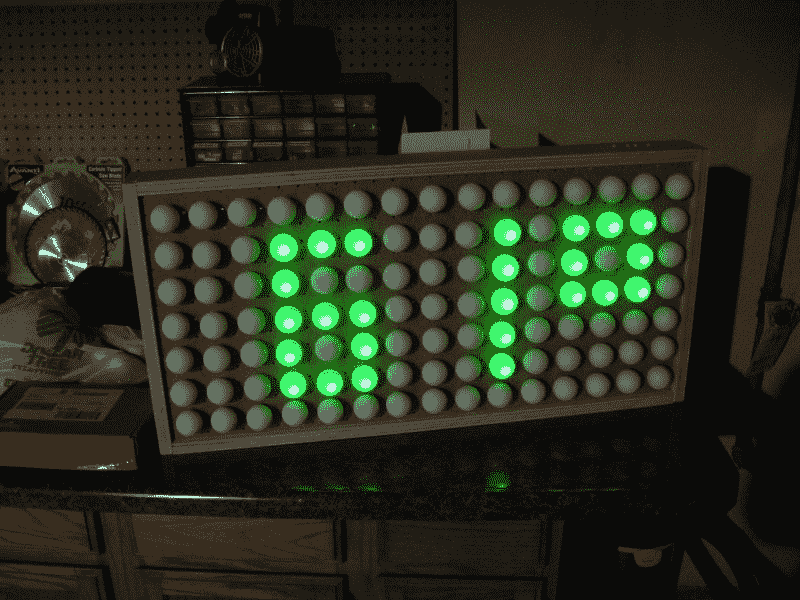

# 如何建立一个乒乓球显示器

> 原文：<https://hackaday.com/2011/01/31/how-to-build-a-ping-pong-ball-display/>

如果你一直渴望拥有自己的发光显示器，我们可以通过分享一些简单的建造技术来帮助你，这些技术将会产生一个有趣的项目，就像你在上面看到的那样。这是一个超级精确的时钟，使用乒乓球作为 led 的扩散器，但只要有一点点知识，你就可以把它变成一个完整的字幕显示。休息后加入我，我将分享项目的细节，并给你你需要知道的一切来建立你自己的。

## 规划

花些时间坐下来，想想你的显示器需要多少像素。上面你可以看到我在一些垃圾邮件背面画的草图。因为我的商店需要一个时钟，所以我将只包含十二小时时间显示的 led。但是我确实计划用扩散器(乒乓球)填充整个网格，因为这样看起来会更酷一点。我还计划在整个显示屏上加一个圆环，这样我最终的像素区域将是 15×7。注意每个数字下面的数字，它们是 LED 计数。

在这一点上，我也为电子设备做了相当多的规划。我需要确保我正确地处理电流，这样我就不会烧坏任何 led 或驱动它们的芯片。现在，让我们跳过电气问题，建立实际的显示。

## 材料

首先，你需要一个盒子来承载这个项目。我选择使用钉板作为钟面，因为它已经有了精确间隔的孔，可以非常舒适地安装 5 毫米的 LED。钉板将被包在胶合板框架中，这给了它强度、保护以及安装按钮和其他硬件的地方。你还需要所有的发光二极管(在我的例子中是 46 个)和乒乓球(总共 105 个)。

从一开始，我就想用手头的零件完成这个项目。我已经有了钉板的碎片，还有为我的办公室做壁挂式办公桌时剩下的胶合板。大多数电子硬件都是从另一个项目中抢救出来的(稍后会有更多的介绍)，最后我只需要买乒乓球、热熔胶和一些按钮安装硬件。以下是显示器本身的列表，不包括控制板和按钮:

*   面部钉板
*   框架用胶合板
*   发光二极管
*   带状电缆
*   22 号连接线
*   IDC 连接器
*   KK 连接器或其他 0.1 英寸间距的连接器
*   木工工具:台锯、圆锯、直尺
*   凹头螺钉夹具和凹头螺钉
*   热胶枪和热胶水
*   焊接用品

## 组装箱子

我首先在一块钉板上划出数字，然后沿着切割线夹住一把直尺，用圆锯将其修剪成合适的尺寸。

钉板通常有点薄，所以你应该在它周围做一个框架，使它坚固。我刚刚得到一些基本的木工工具，所以我已经撕开了 3”胶合板件，用对接接头将它们切割成一定长度，然后切割一个与锯片宽度相同的护墙板来接收钉板。

我买了这个 Kreg 袖珍螺丝夹具时，我正在建设我的办公桌，我喜欢它。在这里，我在长杆的末端切了一个小螺丝孔。它们贴在侧栏上，两个螺丝会把它们固定得很紧。你可以花大约 20 美元买到这个夹具，但如果你不想花这笔钱，只需从外面预钻和埋头钻一些孔，并用木螺钉将你的框架固定在一起。

这是成品盒子的外面。总的来说，我在这个项目上投入了大约 90 分钟。大部分时间都花在了仔细测量上，这一点你应该认真对待。一次错误的切割可能会导致即兴的实地考察以获得更多的补给。

里面有足够的空间放电线和控制板。现在开始插入发光二极管。

我在制作 LED 南瓜灯的过程中度过了一段美好的时光，但是自从万圣节之夜以来，这个硬件就一直没有被使用过。在这里，我已经拆下了原板的所有组件，并剪下了所有的发光二极管，按照颜色将它们分开。我将在这个项目中重复使用所有的绿色发光二极管、晶体管、引脚头、一些电阻和许多较长的电线。

首先将指示灯按入钉板背面的位置。它们会很紧，我发现这个过程让我的手指一会儿就疼了。我用电池和电阻检查了每个 LED，以确保我的极性正确，并且它们都工作正常，颜色相同。上面我已经开始用带状导线焊接每个 LED 的所有阴极。阴极按数字分组，并通过一个 NPN 晶体管接地。

这里所有的阴极连接已经完成。我用连接导线将四条总线中的每一条连接到一边，并将它们一起插入一个 4 通道 KK 连接器。这将很容易将数字的低端插入控制板的引脚头。别忘了把这些线热粘在钉板上，作为一种消除应力的方式。

现在是时候将每个数字中相同像素的阳极焊接在一起了。我使用的废件带状电缆从最后一步的过程中做到这一点。在右上方，您可以看到两条带状电缆，其侧面悬挂着 IDC 连接器。顶部的一束驱动每个数字中 13 个 led 中的 7 个。底部的束驱动其余六个束。这些将插入驱动板上的双引脚接头，通过一个电阻将像素连接到一对移位寄存器。小时和分钟之间的冒号与小时十位数组合在一起，而小时十位数只有数字 1 的像素。

现在是时候确保一切正常了。在展示完成之前，我们确实需要添加乒乓球作为扩散器，但是如果有问题，你不希望必须移除球来修复它。现在让我们构建并测试控制电路。

## 电气设计

我想用手头的零件来做这个项目。我有很多 595 移位寄存器，但有一个问题；电源引脚的绝对最大额定值为 70 mA。如果我运行每个不高于 10 mA 的 led，并在两个移位寄存器之间分割总共 13 个像素，我就可以绕过这个限制。

这就解决了高端问题。为了切换每个数字的低端，我采购了 2N3904 NPN 晶体管。它们的集电极电流限制为 200 mA，当显示数字 8 时，它不会吸收数字上的 130 mA 最大值。

多路复用由运行在 8 MHz 内部 RC 振荡器上的 ATmega168 处理。这使得在没有任何可见伪像的情况下驱动显示器变得轻而易举，但在精确计时方面却很糟糕。我手头有一个 Maxim DS3232 实时时钟，可以非常准确地记录时间。它有一个备用电池，可以在显示器断电时保持时间。这是完美的，因为我打算从我的商店板凳插座供电。当我不工作的时候，我会把它们关掉，这意味着只有当有人看到的时候，钟才会被点亮。

本指南旨在关注物理构建，而非电子设计。如果您自己制作，最好选择在每个引脚上提供恒定电流的移位寄存器。这样，发光二极管可以更亮，而且不必担心推高移位寄存器的电流额定值。大多数恒流驱动器都是低端，这意味着您可以使用 P 沟道 MOSFETS、PNP 晶体管或类似器件来切换每个数字的高端。基本上和我在这里做的相反。

查看 [LED 南瓜矩阵](http://hackaday.com/2010/10/26/70-led-matrix-in-a-jack-o-lantern/)了解更多关于设计您自己的多路复用显示器的信息。至于恒流驱动器，在[这个白板/LED 帐篷项目](http://hackaday.com/2011/01/27/conways-wall-of-life-and-whiteboard-emporium/)中使用了一些不错的硬件。只是不要觉得局限于 Maxim 部分，因为它们通常很难找到。

## 构建控制器

设计好电路后，接好线，写些固件就行了。

这是试验电路板电路。您可以看到两个 IDC 连接器通过电阻跳线连接到试验板上的移位寄存器。右边的黄线将数字阴极连接到各自的晶体管。前景是分线板上的 [DS3232。你可以看到被黑掉的固定器](http://hackaday.com/2010/04/29/surface-mount-breakout-boards/)中的[硬币盒。我使用万用表来测量该芯片提供的 1 Hz 方波的频率，并使用总线盗版来查看 i2c 通信的情况。现在它起作用了，我只需要找到一个更长久的解决方案。](http://hackaday.com/2011/01/11/button-cell-connectors-for-breadboarding/)

瞧啊。成品控制器板的顶部。注意接收 DS3232 分线板的两个插脚插座。

以及底部的点对点焊接。这大概花了四个小时才完成。现在是冬天，我不喜欢用氯化铜蚀刻电路板，所以我走了这条路。

拼图的最后一块是添加按钮。我知道我有一个索尼立体声系统的旧电路板。

我需要四个按钮，所以我用了一个 Dremel 把这个部分从大板上分离出来。我添加了两个孔，用于安装和焊接导线(从南瓜重复使用)终止于另一个 KK 连接器。

这是按钮板下面的视图。我必须移除将按钮连接成矩阵的电阻，并使用热胶来消除应变。

在去了一趟 Ace Hardware 之后，我能够安装按钮板了。我首先在一张纸上追踪按钮的位置，然后用它作为模板在胶合板箱的顶部钻孔。你只能辨认出每个按钮上面参差不齐的洞。

在五金店的时候，我也捡了一个销钉。在这里，我将它切割成一定长度，用砂纸将顶部边缘磨平(我用电钻旋转了定位销)，并为定位销加了一个孔。

一旦安装完毕，我会在每个按钮销钉的孔里粘上一个完成的钉子，这样它们就不会掉出来。

这是成品。我喜欢！

一切正常，是时候添加扩散器了。我原本打算从一元店买乒乓球，但他们只有六个 9 包。最后我在网上订购了一个。我在每个球上钻了一个洞，让 led 可以穿过，然后用热胶水把它们粘在一起。确保你使用的钻头又好又锋利。

这里有一个开灯测试。

另一张是关灯的。

## 结论

我对事情的结果很满意。如果你自己做一个，考虑使用我之前提到的恒流 LED 驱动器。此外，我有水晶般透明的 LED 封装，你可能想尝试漫射封装。你可以看到每个乒乓球的顶部都有一个亮点就是因为这个。另一方面，在明亮的光线下，你仍然可以分辨出时间，因为这些亮点，所以在你购买所有部件之前，先测试一下。

当所有的都说了，做了，这是容易和快速建立的显示部分。焊接控制板和完成固件编写需要更长的时间。git 资源库的链接包含在下面的参考资料部分。

## 资源

[源代码库](https://github.com/szczys/Ping-Pong-Clock)

## 跟我来