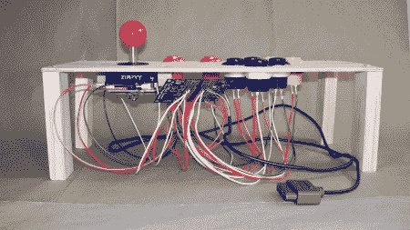

# SNES 街机控制器

> 原文：<https://hackaday.com/2011/01/30/snes-arcade-controller/>



[丹尼尔]正在制作一个迷你街机柜，里面有一个 SNES。他想为它制作一个街机控制器，并选择[从零开始构建东西](http://www.flickr.com/photos/daniel_ericka/5398643353/in/set-72157625933226212/)而不是破坏一个原始的硬件。我们几乎能感觉到你们松了一口气。他给我们发了一些他身材的好照片，并指出他用的是[evimad scientist AVR 板](http://evilmadscience.com/tinykitlist/112-tiny2313)中的一个，里面有一个 ATtiny2313。街机按钮在 [sparkfun](http://www.sparkfun.com/products/9180) 很容易买到。这个项目的源代码将在休息后公布。

```

/**
 * Emulate a 16-bit input shift register with integrated pullup resistors.
 * In other words, a SNES controller.
 *
 * Daniel Holth
 */

#include
#include
#include

ISR(SIG_PIN_CHANGE)
{
 /* Pin change interrupt for latch */
 USIDR = PINA | (PIND &amp;amp; 0b01111100) | (PINB &amp;lt;&amp;lt; 7);
 USISR = (1 &amp;lt;&amp;lt; USIOIF); // clear overflow bit, set counter to 0
 USICR |= (1 &amp;lt;&amp;lt; USIOIE); // enable overflow interrupt
}

ISR(SIG_USI_OVERFLOW)
{
 /* USI finished shifting out 8 bits... */
 USIDR = (PINB &amp;lt;&amp;lt; 3) | 0x0f;
 USISR |= (1 &amp;lt;&amp;lt; USIOIF); // clear overflow bit
 USICR &amp;amp;= (0xff ^ (1 &amp;lt;&amp;lt; USIOIE)); // disable overflow interrupt
 // TODO: output should be low after all 16 bits have been read out,
 // according to &lt;a href=&quot;http://www.raphnet.net/electronique/arcade_control/arcade_control_en.php&quot; target=&quot;_blank&quot;&gt;http://www.raphnet.net/electronique/arcade_control/arcade_control_en.php&lt;/a&gt;
}

int main() {

 USIDR = 0xff;
 USICR = (1 &amp;lt;&amp;lt; USIWM0) | (1 &amp;lt;&amp;lt; USICS1); // 3-wire mode; external, positive edge.
 // USICR = (1&amp;lt;&amp;lt;USIWM0)|(1&amp;lt;&amp;lt;USICS0)|(1&amp;lt;&amp;lt;USICS1); // negative edge

 DDRA = 0;
 DDRD = 0;
 DDRB = 1 &amp;lt;&amp;lt; 6; // MISO

 // Enable pullups
 PORTA = 0x3;
 PORTB = 0b11111;
 PORTD = 0xfc;

 // USIDR is shifted out MSB first.

 // pin change interrupt for latch pin
 PCMSK = (1 &amp;lt;&amp;lt; 5);
 GIMSK |= (1 &amp;lt;&amp;lt; PCIE);

 sei();

 while (1) {
 sleep_mode();
 }
}

```