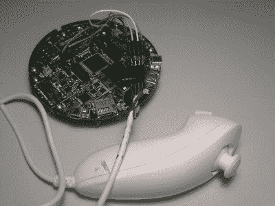

# Evalbot 双截棍控制

> 原文：<https://hackaday.com/2011/01/31/evalbot-nunchuck-control/>

[Martin]最近得到了他的 evalbot，想尝试用他的 Wii 双截棍控制它。经过反复试验，他终于让它工作了。他展示了用双截棍控制机器人实际上非常简单，但在这个过程中还有一些其他的技巧可能非常有用。一个事实是，他为双截棍获取能量的点很容易在马达上短路。他用胶带把他的包起来，但是我们可以看到这个小虫子在我们弄清楚它是什么之前纠缠了我们一会儿。您可以下载他的代码，并在他的网站上看到他的构建过程。休息之后，请务必观看它在加速度计和操纵杆模式下工作的视频。

[https://www.youtube.com/embed/WpGJNhKFiE8?version=3&rel=1&showsearch=0&showinfo=1&iv_load_policy=1&fs=1&hl=en-US&autohide=2&wmode=transparent](https://www.youtube.com/embed/WpGJNhKFiE8?version=3&rel=1&showsearch=0&showinfo=1&iv_load_policy=1&fs=1&hl=en-US&autohide=2&wmode=transparent)