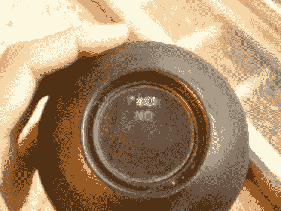

# 把 F 炸弹丢进一个神奇的 8 球里

> 原文：<https://hackaday.com/2011/01/31/drop-f-bombs-into-a-magic-8-ball/>

人们在寻找一些俗物来装饰他们的咖啡桌时，不用再找了。[Wizgirl 的] [magic 8-ball hack 让你改变](http://www.instructables.com/id/Magic-F-Bomb/)里面的信息，她的信息都包括最强大的四个字母的单词。为了做到这一点，她完全替换了里面的信息立方体，用一张塑料做了一个，塑料标签制造商的信息标签，并制作了眼睛使它漂浮起来…太棒了。

整个东西和原来的液体重新组合在一起了，但是她还没有完成。一点创造性的情况下修改离开这个神奇的 8 球看起来像一个卡通炸弹，完成了厚厚的白色保险丝。她现在自豪地拥有了一个神奇的 f 炸弹。

[谢谢你的钱]