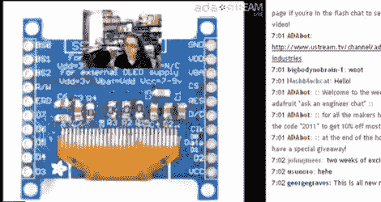

# “问工程师”Adafruit 的实时流

> 原文：<https://hackaday.com/2011/01/31/ask-an-engineer-live-streams-at-adafruit/>

我(Caleb)终于有机会在 Adafruit.com 赶上了一个名为“[问工程师](http://www.adafruit.com/index.php?main_page=chat&zenid=a5cbe843bde311db9b1e6f72c923a329)”的实时聊天会议。我又惊又喜。虽然这个节目只有一个小时，但是它包含的信息量是非常惊人的。他们开始了，宣布一个新的，[这个看起来很酷的触摸屏系统](http://www.adafruit.com/index.php?main_page=product_info&cPath=51&products_id=330&zenid=a5cbe843bde311db9b1e6f72c923a329)，产品，并检查技术规格。这很快变成了一个关于如何使用和修改设备的问答环节。[Limor]，又名[ladyada]知识渊博，设计它的设计师[rossum]甚至出现在聊天中，填补了这一罕见的空白。在那之后，有一个普通的问答时间，人们飞快地提出问题，我无法全部看完，也无法跟上她的回答。这很有趣，坦率地说，我觉得时间太短了。

请务必在美国东部时间周六晚上 10 点查看