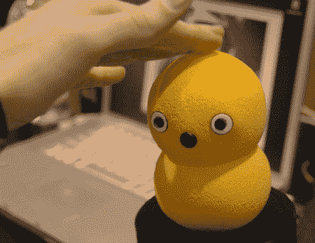

# Keepon 终于有了更便宜的版本

> 原文：<https://hackaday.com/2011/02/01/keepon-finally-gets-a-cheaper-version/>

Keepon 是一个可爱的机器人，旨在通过其欢快的舞蹈动作帮助自闭症儿童，似乎终于有了一个更便宜的版本。原版花了 30，000 美元，不仅仅是跳舞。事实上，几年前在 CES 上，我们已经让[用它](http://hackaday.com/2010/01/08/ces-keepon-keeps-on/)玩了一会儿。商业版很可能不会有面部识别或第一部的任何其他花哨功能，但我们希望它可以跳得很好。我们实际上已经看到了几个[自制](http://hackaday.com/2009/10/29/keepon-eat-your-heart-out/)版本[版本](http://hackaday.com/2009/10/31/another-mini-keepon/)，我们希望新版本有一些主要的黑客潜力。当你看到一些钱又回到自闭症研究中时，拥有这些可爱的小机器人的诱惑变得更加强烈。