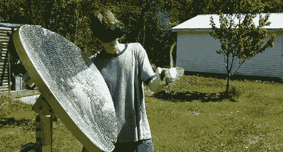

# 迪斯科死亡射线

> 原文：<https://hackaday.com/2011/02/01/disco-death-ray/>

掌握熔化玻璃或瞬间点燃大多数日常材料的能力可能会令人陶醉。通过一点数学知识，大量的耐心，和 5800 块 1cm 的镜子，[这个建筑](http://gizmodo.com/5747513/teen-glued-5800-mirrors-onto-satellite-dish-for-solar-death+ray)需要焊接眼镜来观察 1-2cm 的焦点。据说这个想法可以追溯到[阿基米德](http://web.mit.edu/2.009/www/experiments/deathray/10_ArchimedesResult.html)，这个更便携的抛物线项目非常适合你的家庭燃烧需求。不幸的是，这个设置似乎在某一点上自焚了，尽管这为版本 2 腾出了空间，据报道，版本 2 将把镜像数量增加到 32，000 左右。

还有很多其他方法可以制造死亡射线，包括使用[激光器](http://hackaday.com/2010/01/15/phaser-to-laser-mod-puts-out-465mw/)或[透镜](http://www.instructables.com/id/Giant-Fresnel-Lens-Deathray-An-Experiment-in-Opti/)。你认为你有更好的毁灭工具吗？一定要[告诉我们](http://hackaday.com/contact-hack-a-day/)这件事。