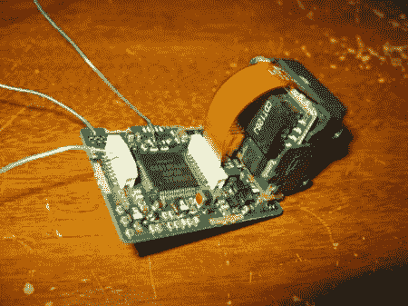

# 让液晶取景器重现生机

> 原文：<https://hackaday.com/2011/02/02/bringing-an-lcd-viewfinder-back-to-life/>

[Foobarbob]发布了一个非常简单的工作，让液晶取景器复活。他没有具体说明是什么问题，但由于他更换了背光，我们猜测这是主要问题。这是从 JVC 摄像机上撕下来的。带液晶取景器的摄像机在车库销售中越来越普遍，所以我们很惊讶没有看到更多的使用。[Foobarbob]打开它，[找出电源线，用 LED 和由瓶盖制成的临时扩散器取代背光](http://forums.hackaday.com/viewtopic.php?f=3&t=135)。他的结果看起来很棒，我们可以看到这对 HMD 来说是完美的，或者可能是一个自制的 VR 头盔。