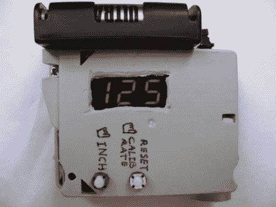

# 数字卷尺

> 原文：<https://hackaday.com/2011/02/02/digital-measuring-tape/>

有了这把卷尺，你永远也不会短缺。这是因为设备中实际上没有任何磁带；它[根据轮子](http://www.instructables.com/id/Digital-Measuring-Tape)的旋转来测量距离。在房间里滚动它，你会得到这个小家伙走过的距离的精确测量值。像[周一的蚀刻草图](http://hackaday.com/2011/01/31/etch-a-sketch-computer-is-a-surprisingly-simple-hack/)一样，它使用鼠标的编码轮作为输入。来自无处不在的外设的 IR 发射器和传感器在承载 PIC 16F819 的 PCB 上找到了新家。它监控旋转，将其转换成英寸，然后在 7 段显示器上显示出来。方便，又便宜！