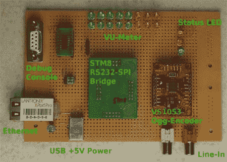

# 有一张收音机的脸？

> 原文：<https://hackaday.com/2011/02/02/have-a-face-for-radio/>

在奥地利技术联盟/hackerspace [ [Otelo](http://translate.google.com/translate?js=n&prev=_t&hl=en&ie=UTF-8&layout=2&eotf=1&sl=de&tl=en&u=http%3A%2F%2Fwww.otelo.or.at%2F) ]成员的帮助下，[Georg]开发了一个联网的音频流板，组件价值不到 20 美元。由于显而易见的原因，它被命名为 OggStreamer，旨在将音频从混音板实时转发到 [Icecast](http://www.icecast.org/) 服务器(SHOUTcast 的开源实现)。该板基于 STM8 [发现套件](http://hackaday.com/2011/02/01/what-development-board-to-use/)和 [Xport](http://hackaday.com/2010/08/14/rs232-and-rs485-networking-no-code-required/) Pro。它具有立体声输入，板载 OGG Vorbis 编码器，并且(最重要的是)运行的是 uClinux。我们认为这是经过深思熟虑的——但不要相信我们的话 OggStreamer 去年在 Lantronix [XPort Pro 设计竞赛](http://www.lantronix.com/info/xportpro/designcontest/)中获得了第二名，并且【Georg】已经[广泛地记录了它](http://www.otelo.or.at/fileadmin/content/OggStreamer/OggStreamerDoku-CC-BY-SA.pdf)(pdf)。