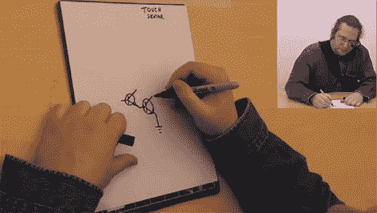

# 简单的触摸传感器和其他课程

> 原文：<https://hackaday.com/2011/02/03/34077/>

[HankDavis]把这个链接发给了一个视频,展示了如何使用“达林顿对”制作触摸传感器的教程。在视频中，我们了解了这个想法以及我们将如何构建它。[Thad]用简单的术语详细解释了这是如何工作的，并清楚地说明了这一点。不幸的是，它们没有展示一个实际构建的系统，但这是如此简单，你可以很快地把它扔在一起，自己去看。这是一个很好的教训，告诉你如何在你的项目中使用一个简单的触摸传感器。这个视频似乎是一系列课堂视频中的一个，你可以在 youtube 上的这个帐户下找到其他几个视频。

[https://www.youtube.com/embed/s61U35Nmpx0?version=3&rel=1&showsearch=0&showinfo=1&iv_load_policy=1&fs=1&hl=en-US&autohide=2&wmode=transparent](https://www.youtube.com/embed/s61U35Nmpx0?version=3&rel=1&showsearch=0&showinfo=1&iv_load_policy=1&fs=1&hl=en-US&autohide=2&wmode=transparent)